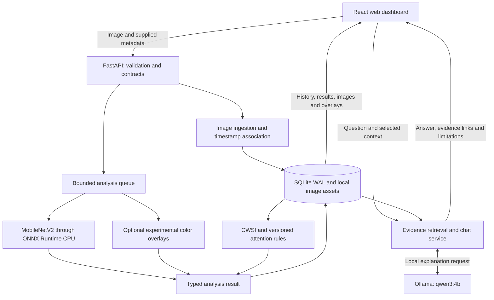

# Root-Cause

### Crop observations, traceable analysis, and a local AI explanation layer

Root-Cause is a hackathon prototype that turns a crop image and its supplied metadata into a stored observation, an analysis result, and an explanation a farmer can question. A local web dashboard brings together image inspection, attention flags, measurement history, and an Ollama chatbot.

The core workflow is implemented and integrated. The prototype uses recorded images instead of physical field hardware, a pretrained PlantVillage classifier instead of training during the demo, and named zones instead of GPS maps. Missing measurements stay unknown.

## What the prototype does

- Imports JPEG/PNG images with source information, optional capture timestamps, crop hints, and supplied measurements.
- Preserves original image bytes and serves orientation-normalized images for inspection.
- Runs a local leaf classifier, saves results, and retains earlier results when an observation is analyzed again.
- Shows optional experimental leaf boxes and discoloration overlays, alongside their method and limitations.
- Calculates CWSI when the required synchronized temperature inputs are available.
- Flags observations for review using an explicit, versioned demo rule.
- Answers questions through local Ollama, using stored evidence and bounded read-only tools.

The AI explains evidence; it does not create tasks, operate equipment, or turn generated text into measurements.

### English and Hindi

Choose **हिन्दी** in **भाषा / Language** at the top of the dashboard. Controls, measurement/status labels, common warnings, and suggested questions switch to Hindi; the local assistant is asked to reply in Hindi. The choice is saved in this browser and sets the document language for accessibility. Changing language starts a fresh chat and cancels any pending reply.

Stored measurements, source notes, IDs, model identifiers and API enum values are preserved. User-supplied notes and labels without a dictionary entry remain in their original language. Hindi explanations are generated by the local model and can contain wording errors; they are not a professionally reviewed translation. Chat requests accept optional `language: "en" | "hi"`, defaulting to English for existing clients.

## Architecture



Image analysis and chat share stored evidence but have separate responsibilities. The classifier produces predictions; the formula engine calculates supported metrics; rules decide attention status; the language model explains the available records. Quantitative facts in chat are rendered by backend code rather than regenerated by the model.

| Layer | Implementation | Reason for the choice |
|---|---|---|
| Interface | React, TypeScript, Vite | Flexible local web UI and parallel frontend development |
| API and orchestration | Python, FastAPI, Pydantic | Fast integration with typed inputs and outputs |
| Persistence | SQLite in WAL mode, local assets | Lightweight storage with observation and result history |
| Vision | Pinned MobileNetV2 ONNX model, CPU provider | Native inference execution while leaving GPU memory for Ollama |
| Visual candidates | Optional color heuristics | Demonstrates overlay plumbing with explicit experimental status |
| Explanations | Ollama, qwen3:4b | Local model with a simple HTTP listener and read-only evidence tools |

## How the architecture evolved

The initial proposal targeted an edge hardware system: C++ ingestion, lock-free buffers, zero-copy GPU paths, TensorRT, thermal telemetry, and a Qt interface. The hackathon implementation preserves the evidence pipeline while changing the execution strategy to fit available hardware and time.

| Development decision | Implemented change | Consequence |
|---|---|---|
| No field hardware available | Import recorded/dataset images and supplied metadata | Demonstration evidence is distinguishable from live telemetry |
| Limited time and laptop resources | Use a pretrained PlantVillage model | No training or distributed training is needed for the demo |
| Python backend accepted | Use Python orchestration and native inference libraries | Original C++ transport and memory guarantees remain future work |
| Qt too restrictive for the scope | Move to a local web dashboard | Frontend contributors can work against shared HTTP contracts |
| Avoid waiting for uneven sensor rates | Associate supplied timestamps separately | No assembly calls or live ring buffer are required in this prototype |
| Onsite organization needs zones | Use explicitly named zones | No invented GPS position or map layer |
| Keep explanations grounded | Separate stored facts from generated wording | Missing values remain unknown; chat cannot mutate evidence |
| Preserve performance and history | Store measurements/results and serve images when inspected | Reanalysis remains traceable without a mapping subsystem |

Development proceeded in five stages:

1. **Define the evidence contract.** Establish observation identity, source metadata, timestamps, measurement quality, result statuses, coordinates, and error envelopes. Split frontend work into UI and API integration briefs.
2. **Build the backend without waiting for the UI.** Implement ingestion, SQLite storage, timestamp association, persisted jobs, local inference, formulas, attention rules, and explanation tools.
3. **Prepare and verify real assets.** Download model artifacts with a pinned revision and checksum; record sample image provenance; evaluate model behavior separately from inference metadata.
4. **Integrate the contributors' frontend.** Restore the dashboard after a semantic merge regression, reconcile wire types/routes, connect import and polling, and handle cancellation and observation context changes.
5. **Verify the complete workflow.** Exercise live imports, analysis, overlays, attention navigation, and Ollama explanations. Record limitations and reviewable commit groups before cosmetic finishing.

See [the architecture explanation](docs/ARCHITECTURE_EXPLAINED.md), [backend implementation guide](docs/BACKEND_IMPLEMENTATION.md), and [integration record](docs/INTEGRATION_RECORD.md) for the decisions and implementation detail. The architecture explanation includes earlier planning states; the integration record describes the completed integration.

## Run locally

Prerequisites: Python 3.12 recommended, Node.js/npm, and an installed Ollama runtime. Run the following from the repository root containing `backend/` and `frontend/`.

### 1. Prepare Python and assets

```powershell
python -m venv .venv
.\.venv\Scripts\python.exe -m pip install -r requirements.txt
.\.venv\Scripts\python.exe tools\prepare_assets.py model
.\.venv\Scripts\python.exe tools\prepare_assets.py samples
```

The model is required for classification. The sample download prepares a small demonstration/evaluation set; it does not download the complete training dataset. Model files and local data are ignored by Git.

### 2. Prepare the local assistant

```powershell
ollama pull qwen3:4b
ollama serve
```

Keep the listener running in its own terminal. If Ollama is already listening, use that existing instance.

### 3. Build and start the application

In another terminal:

```powershell
npm.cmd --prefix frontend ci
npm.cmd --prefix frontend run build
.\.venv\Scripts\python.exe -m backend --config config\demo.json
```

Open **http://127.0.0.1:8000/**. Interactive API documentation is at **http://127.0.0.1:8000/docs**.

Build before starting the backend: the server mounts `frontend/dist` at startup. Run one backend process for this prototype. In the original development workspace, the prepared environment lives one level above the connected checkout, so the Python command is `..\.venv\Scripts\python.exe`; a fresh clone uses the commands above.

For frontend development, run `npm.cmd --prefix frontend run dev` alongside the backend. Vite proxies `/api` to port 8000. Live mode is the default; explicit development fixture mode never activates after a live request failure and is rejected in production builds.

Packages, model weights, and samples require initial downloads. Analysis uses local assets and chat uses the local Ollama listener after setup. A forced network-disconnection rehearsal has not yet been completed.

## Try the demo

1. Select the seeded demo zone, or create a named zone.
2. Import a close-up leaf image and its known metadata. Leave unknown capture times and measurements blank.
3. Select **Analyze** and inspect the prediction, model score, method information, limitations, and any experimental overlays.
4. Open **Attention** to review configured flags and return to the source observation.
5. Open chat and ask what the observation suggests or which measurements are missing. Follow the returned evidence links.

Downloaded samples live under `data/evaluation/`. Their manifest stores evaluation labels separately; do not copy those labels into inference metadata. Sample source URLs can be supplied as provenance.

## Verification

For a visible sensor-data/formula walkthrough, see [the CWSI demonstration](docs/FORMULA_DEMO.md). Five explicitly simulated cases exercise valid arithmetic, changed inputs, missing data, timestamp mismatch and invalid baselines through the live API and stored dashboard results.

```powershell
.\.venv\Scripts\python.exe -m unittest discover -s tests -v
npm.cmd --prefix frontend run typecheck
npm.cmd --prefix frontend run verify:api
npm.cmd --prefix frontend run verify:i18n
npm.cmd --prefix frontend run build
```

Recorded integration verification: **28 backend tests passed**, frontend API contract/cancellation checks passed, and the production build passed. Browser checks covered real image import, result polling, overlays, attention navigation, local explanations, and an explicitly simulated aerial image returning unsupported analysis.

Optional model and pipeline checks:

```powershell
.\.venv\Scripts\python.exe tools\evaluate_model.py
.\.venv\Scripts\python.exe tools\smoke_backend.py --chat
```

Run the smoke tool with the normal backend stopped: it creates its own application instance against the demo data. It stores new observations; repeated runs add records.

The recorded 12-image model smoke evaluation matched **11 source labels**. This small sample is not independent field validation, may overlap training data, and does not establish deployment accuracy. Reports are in [docs/verification](docs/verification/).

## Capability boundaries

| Capability | Current status |
|---|---|
| Close-up leaf classification | Implemented pretrained image-level model; scores are not calibrated diagnostic probabilities |
| Leaf boxes and discoloration masks | Experimental color-based candidates; not validated disease localization or severity |
| Aerial field images | Import and inspection supported; disease inference unsupported |
| CWSI | Available only with valid synchronized canopy/air/baseline inputs in compatible units |
| Soil and thermal measurements | Supplied metadata only; no physical sensor acquisition |
| Attention flags | Versioned prototype rule; no flag does not establish field health |
| Local AI explanations | Implemented with evidence retrieval and bounded validation/retries; wording can still be inaccurate |
| C++/TensorRT edge transport | Proposed future deployment path |
| Training and multi-device processing | Not implemented in this prototype |

## Repository guide

```text
backend/              API, contracts, storage, ingestion, jobs, vision, rules, chat
frontend/             React dashboard, API client, state hooks, explicit fixtures
config/               Demo settings and example backend configuration
tools/                Model/sample preparation, evaluation, pipeline smoke checks
tests/                Backend validation and behavior checks
docs/                 Architecture decisions, contracts, handoffs, verification
models/               Downloaded model artifacts (local, ignored)
data/                 Images, manifests, assets and database (local, ignored)
```

The model preparation tool records the pinned artifact source and SHA256. Dataset samples record source revision, URL, and checksum. Upstream sources are identified in [the backend guide](docs/BACKEND_IMPLEMENTATION.md#assets-and-offline-behavior); downloaded assets are not bundled in Git.

Next work can build on the current contracts: improve demo presentation, incorporate the team's crop references and formulas, evaluate field images, and replace experimental overlays with validated models. Native hardware adapters should follow profiling and actual device requirements.
